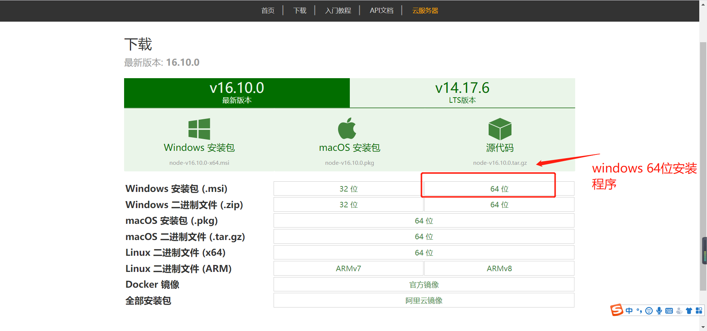
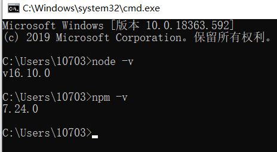
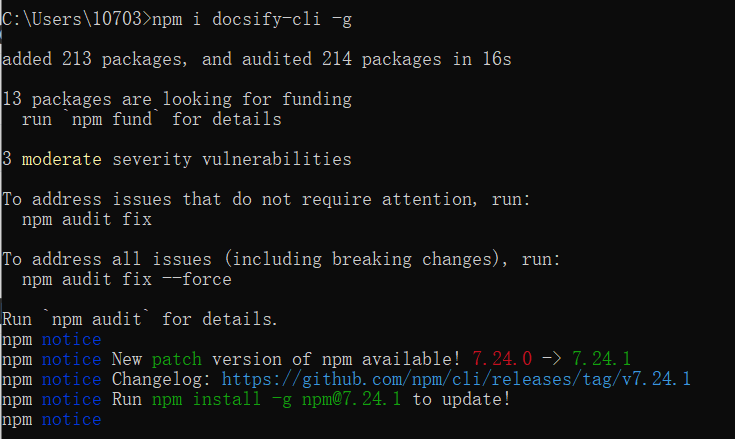
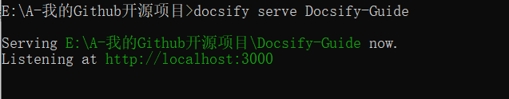
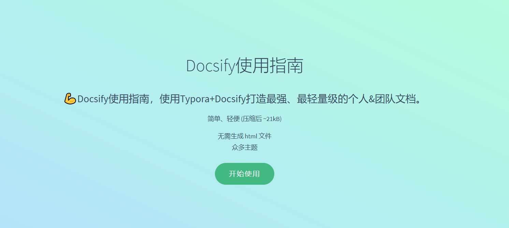
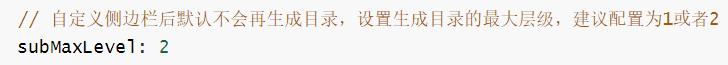
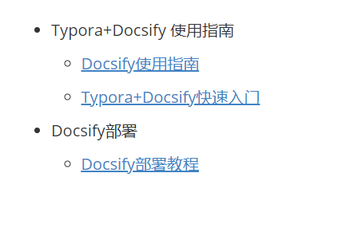
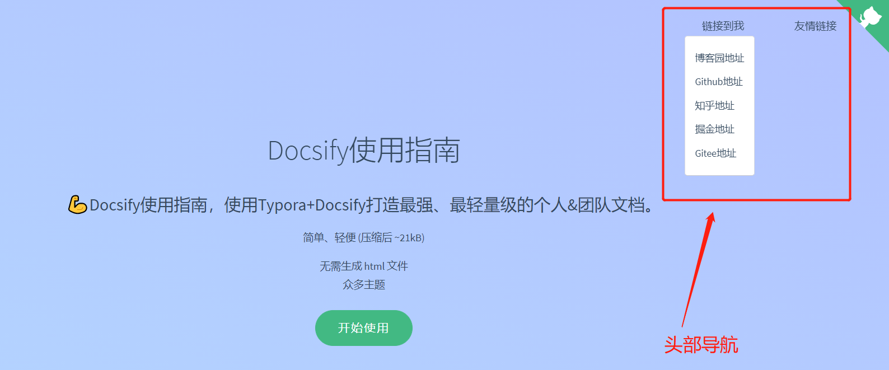

# [Docsify使用指南（打造最快捷、最轻量级的个人&团队文档） ](https://www.cnblogs.com/Can-daydayup/p/15413267.html)


**思维导航：**

- [前言](https://www.cnblogs.com/Can-daydayup/p/15413267.html#_label0)
- [什么是Docsify？](https://www.cnblogs.com/Can-daydayup/p/15413267.html#_label1)
- [Docsify的特性](https://www.cnblogs.com/Can-daydayup/p/15413267.html#_label2)
- [轻量&完善的Docsify模板](https://www.cnblogs.com/Can-daydayup/p/15413267.html#_label3)
- [Node.js 安装配置](https://www.cnblogs.com/Can-daydayup/p/15413267.html#_label4)
- [docsify-cli工具安装](https://www.cnblogs.com/Can-daydayup/p/15413267.html#_label5)
- [项目初始化](https://www.cnblogs.com/Can-daydayup/p/15413267.html#_label6)
- [本地运行docsify创建的项目](https://www.cnblogs.com/Can-daydayup/p/15413267.html#_label7)
- [基础配置文件介绍](https://www.cnblogs.com/Can-daydayup/p/15413267.html#_label8)
- [基础配置项（index.html）](https://www.cnblogs.com/Can-daydayup/p/15413267.html#_label9)
- [封面配置文件（_coverpage.md）](https://www.cnblogs.com/Can-daydayup/p/15413267.html#_label10)
- [侧边栏配置文件（_sidebar.md）](https://www.cnblogs.com/Can-daydayup/p/15413267.html#_label11)
- [导航栏配置文件（_navbar.md）](https://www.cnblogs.com/Can-daydayup/p/15413267.html#_label12)
- [全文搜索 - Search](https://www.cnblogs.com/Can-daydayup/p/15413267.html#_label13)
- [Docsify主题切换](https://www.cnblogs.com/Can-daydayup/p/15413267.html#_label14)
- [Docsify详细部署教程](https://www.cnblogs.com/Can-daydayup/p/15413267.html#_label15)
- [相关教程](https://www.cnblogs.com/Can-daydayup/p/15413267.html#_label16)

 

**文章正文：**

[**🚀回到顶部**](https://www.cnblogs.com/Can-daydayup/p/15413267.html#_labelTop)

## 前言

　　网上关于动态文档生成工具有很多如：Docsify、 VuePress、Docute 、Hexo这些都是一些非常优秀的文档生成工具，本章主要介绍如何快速使用Docsify搭建一个快捷、轻量级的个人&团队文档。

[**🚀回到顶部**](https://www.cnblogs.com/Can-daydayup/p/15413267.html#_labelTop)

## 什么是Docsify？

　　一个神奇的文档网站生成器。docsify 可以快速帮你生成文档网站。不同于 GitBook、Hexo 的地方是它不会生成静态的 .html 文件，所有转换工作都是在运行时。如果你想要开始使用它，只需要创建一个 index.html 就可以开始编写文档。

[**🚀回到顶部**](https://www.cnblogs.com/Can-daydayup/p/15413267.html#_labelTop)

## Docsify的特性

- 无需构建，写完文档直接发布
- 容易使用并且轻量 (压缩后 ~21kB)
- 智能的全文搜索
- 提供多套主题
- 丰富的 API
- 支持 Emoji
- 兼容 IE11
- 支持服务端渲染 SSR ([示例](https://github.com/docsifyjs/docsify-ssr-demo))

[**🚀回到顶部**](https://www.cnblogs.com/Can-daydayup/p/15413267.html#_labelTop)

## 轻量&完善的Docsify模板

　　该模板为一个简洁，并且完善的Docsify模板基本上可以满足百分之八十多的团队需求，你可以按照文章中的Docsify环境配置教程把运行Docsify所需要的环境配置起来，通过命令即可查看效果（配置环境顺利的话只要十来分钟）。

> 模板源码地址：[Docsify-Guide👉](https://github.com/YSGStudyHards/Docsify-Guide)
>
> 模板预览地址：[https://ysgstudyhards.github.io/Docsify-Guide/#/👉](https://ysgstudyhards.github.io/Docsify-Guide/#/)

[**🚀回到顶部**](https://www.cnblogs.com/Can-daydayup/p/15413267.html#_labelTop)

## Node.js 安装配置

- [nodejs下载地址](http://nodejs.cn/download/)
- [Node.js最新最详细安装教程](https://blog.csdn.net/Small_Yogurt/article/details/104968169)



win+r：cmd进入命令提示符窗口，分别输入以下命令查看node和npm的版本能够正常显示版本号，则安装成功：

- node -v：显示安装的nodejs版本
- npm -v：显示安装的npm版本



[**🚀回到顶部**](https://www.cnblogs.com/Can-daydayup/p/15413267.html#_labelTop)

## docsify-cli工具安装

> 推荐全局安装 `docsify-cli` 工具，可以方便地创建及在本地预览生成的文档。

```
npm i docsify-cli -g
```



[**🚀回到顶部**](https://www.cnblogs.com/Can-daydayup/p/15413267.html#_labelTop)

## 项目初始化

> 如果想在项目的 `./docs(文件名可以按自己的想法来)` 目录里写文档，直接通过 `init` 初始化项目。

```
docsify init ./Docsify-Guide
```

初始化成功后，可以看到 `./docs` 目录下创建的几个文件

- `index.html` 入口文件
- `README.md` 会做为主页内容渲染
- `.nojekyll` 用于阻止 GitHub Pages 忽略掉下划线开头的文件

直接编辑 `docs/README.md` 就能更新文档内容，当然也可以[添加更多页面](https://docsify.js.org/#/zh-cn/more-pages)。

[**🚀回到顶部**](https://www.cnblogs.com/Can-daydayup/p/15413267.html#_labelTop)

## 本地运行docsify创建的项目

> 通过运行 `docsify serve 项目名称 `启动一个本地服务器，可以方便地实时预览效果。默认访问地址 [http://localhost:3000](http://localhost:3000/) 。

```
docsify serve Docsify-Guide
```



[**🚀回到顶部**](https://www.cnblogs.com/Can-daydayup/p/15413267.html#_labelTop)

## 基础配置文件介绍

> 其实我们维护一份轻量级的个人&团队文档我们只需要配置以下这几个基本文件就可以了。

| 文件作用               | 文件          |
| ---------------------- | ------------- |
| 基础配置项（入口文件） | index.html    |
| 封面配置文件           | _coverpage.md |
| 侧边栏配置文件         | _sidebar.md   |
| 导航栏配置文件         | _navbar.md    |
| 主页内容渲染文件       | README.md     |
| 浏览器图标             | favicon.ico   |

[**🚀回到顶部**](https://www.cnblogs.com/Can-daydayup/p/15413267.html#_labelTop)

## 基础配置项（index.html）

> 下面是一份基础的配置项模板如下(可直接Copy使用)。

[](javascript:void(0);)

```
<!DOCTYPE html>
<html lang="en">

<head>
    <meta charset="UTF-8">
    <title>Docsify-Guide</title>
    <meta http-equiv="X-UA-Compatible" content="IE=edge,chrome=1" />
    <meta name="description" content="Description">
    <meta name="viewport"
        content="width=device-width, user-scalable=no, initial-scale=1.0, maximum-scale=1.0, minimum-scale=1.0">
    <!-- 设置浏览器图标 -->
    <link rel="icon" href="/favicon.ico" type="image/x-icon" />
    <link rel="shortcut icon" href="/favicon.ico" type="image/x-icon" />
    <!-- 默认主题 -->
    <link rel="stylesheet" href="//cdn.jsdelivr.net/npm/docsify/lib/themes/vue.css">
</head>

<body>
    <!-- 定义加载时候的动作 -->
    <div id="app">加载中...</div>
    <script>
        window.$docsify = {
            // 项目名称
            name: 'Docsify-Guide',
            // 仓库地址，点击右上角的Github章鱼猫头像会跳转到此地址
            repo: 'https://github.com/YSGStudyHards',
            // 侧边栏支持，默认加载的是项目根目录下的_sidebar.md文件
            loadSidebar: true,
            // 导航栏支持，默认加载的是项目根目录下的_navbar.md文件
            loadNavbar: true,
            // 封面支持，默认加载的是项目根目录下的_coverpage.md文件
            coverpage: true,
            // 最大支持渲染的标题层级
            maxLevel: 5,
            // 自定义侧边栏后默认不会再生成目录，设置生成目录的最大层级（建议配置为2-4）
            subMaxLevel: 4,
            // 小屏设备下合并导航栏到侧边栏
            mergeNavbar: true,
        }
    </script>
    <script>
        // 搜索配置(url：https://docsify.js.org/#/zh-cn/plugins?id=%e5%85%a8%e6%96%87%e6%90%9c%e7%b4%a2-search)
        window.$docsify = {
            search: {
                maxAge: 86400000,// 过期时间，单位毫秒，默认一天
                paths: auto,// 注意：仅适用于 paths: 'auto' 模式
                placeholder: '搜索',
                // 支持本地化
                placeholder: {
                    '/zh-cn/': '搜索',
                    '/': 'Type to search'
                },
                noData: '找不到结果',
                depth: 4,
                hideOtherSidebarContent: false,
                namespace: 'Docsify-Guide',
            }
        }
    </script>
    <!-- docsify的js依赖 -->
    <script src="//cdn.jsdelivr.net/npm/docsify/lib/docsify.min.js"></script>
    <!-- emoji表情支持 -->
    <script src="//cdn.jsdelivr.net/npm/docsify/lib/plugins/emoji.min.js"></script>
    <!-- 图片放大缩小支持 -->
    <script src="//cdn.jsdelivr.net/npm/docsify/lib/plugins/zoom-image.min.js"></script>
    <!-- 搜索功能支持 -->
    <script src="//cdn.jsdelivr.net/npm/docsify/lib/plugins/search.min.js"></script>
    <!--在所有的代码块上添加一个简单的Click to copy按钮来允许用户从你的文档中轻易地复制代码-->
    <script src="//cdn.jsdelivr.net/npm/docsify-copy-code/dist/docsify-copy-code.min.js"></script>
</body>

</html>
```

[](javascript:void(0);)

[**🚀回到顶部**](https://www.cnblogs.com/Can-daydayup/p/15413267.html#_labelTop)

## 封面配置文件（_coverpage.md）

> [Docsify官网封面配置教程](https://docsify.js.org/#/zh-cn/cover)

### index.html

[](javascript:void(0);)

```
<!-- index.html -->

<script>
  window.$docsify = {
    coverpage: true
  }
</script>
<script src="//cdn.jsdelivr.net/npm/docsify/lib/docsify.min.js"></script>
```

[](javascript:void(0);)

### _coverpage.md

[](javascript:void(0);)

```
<!-- _coverpage.md -->

# Docsify使用指南 

> 💪Docsify使用指南，使用Typora+Docsify打造最强、最轻量级的个人&团队文档。

 简单、轻便 (压缩后 ~21kB)
- 无需生成 html 文件
- 众多主题


[开始使用 Let Go](/README.md)
```

[](javascript:void(0);)



[**🚀回到顶部**](https://www.cnblogs.com/Can-daydayup/p/15413267.html#_labelTop)

## 侧边栏配置文件（_sidebar.md）

> [Docsify官网配置侧边栏教程](https://docsify.js.org/#/zh-cn/more-pages?id=定制侧边栏)

### index.html

[](javascript:void(0);)

```
<!-- index.html -->

<script>
  window.$docsify = {
    loadSidebar: true
  }
</script>
<script src="//cdn.jsdelivr.net/npm/docsify/lib/docsify.min.js"></script>
```

[](javascript:void(0);)

> 在index.html基础配置文件中设置了二级目录



### _sidebar.md

[](javascript:void(0);)

```
<!-- _sidebar.md -->

* Typora+Docsify使用指南
  * [Docsify使用指南](/ProjectDocs/Docsify使用指南.md) <!--注意这里是相对路径-->
  * [Typora+Docsify快速入门](/ProjectDocs/Typora+Docsify快速入门.md)
* Docsify部署
  * [Docsify部署教程](/ProjectDocs/Docsify部署教程.md)
```

[](javascript:void(0);)



[**🚀回到顶部**](https://www.cnblogs.com/Can-daydayup/p/15413267.html#_labelTop)

## 导航栏配置文件（_navbar.md）

> [Docsify官网配置导航栏教程](https://docsify.js.org/#/zh-cn/custom-navbar?id=配置文件)

### index.html

[](javascript:void(0);)

```
<!-- index.html -->

<script>
  window.$docsify = {
    loadNavbar: true
  }
</script>
<script src="//cdn.jsdelivr.net/npm/docsify/lib/docsify.min.js"></script>
```

[](javascript:void(0);)

### _navbar.md

[](javascript:void(0);)

```
<!-- _navbar.md -->

* 链接到我
  * [博客园地址](https://www.cnblogs.com/Can-daydayup/)
  * [Github地址](https://github.com/YSGStudyHards)
  * [知乎地址](https://www.zhihu.com/people/ysgdaydayup)
  * [掘金地址](https://juejin.cn/user/2770425031690333/posts)
  * [Gitee地址](https://gitee.com/ysgdaydayup)


* 友情链接
  * [Docsify](https://docsify.js.org/#/)
  * [博客园](https://www.cnblogs.com/)
```

[](javascript:void(0);)



[**🚀回到顶部**](https://www.cnblogs.com/Can-daydayup/p/15413267.html#_labelTop)

## 全文搜索 - Search

> [全文搜索 - Search](https://docsify.js.org/#/zh-cn/plugins?id=全文搜索-search)👉

[**🚀回到顶部**](https://www.cnblogs.com/Can-daydayup/p/15413267.html#_labelTop)

## Docsify主题切换

> 注意：切换主题只需要在根目录的index.html切换对应的主题css文件即可

详情参考：https://docsify.js.org/#/zh-cn/themes[👉](https://github.com/YSGStudyHards/Docsify-Guide/blob/main/ProjectDocs/Docsify部署教程.md)

[**🚀回到顶部**](https://www.cnblogs.com/Can-daydayup/p/15413267.html#_labelTop)

## Docsify详细部署教程

> [Docsify部署教程👉](https://github.com/YSGStudyHards/Docsify-Guide/blob/main/ProjectDocs/Docsify部署教程.md)

[**🚀回到顶部**](https://www.cnblogs.com/Can-daydayup/p/15413267.html#_labelTop)

## 相关教程

- [docsify-github地址](https://github.com/docsifyjs/docsify/#showcase)
- [docsify快速开始-官方教程](https://docsify.js.org/#/zh-cn/quickstart)
- [使用开源文档工具docsify，用写博客的姿势写文档](https://www.cnblogs.com/throwable/p/13605289.html)

 

> 作者：[追逐时光者](https://www.cnblogs.com/Can-daydayup/)
>
> 作者简介：一个热爱编程，善于分享，喜欢学习、探索、尝试新事物，新技术的程序猿。
>
> 本文版权归作者和博客园共有，欢迎转载，但未经作者同意必须保留此段声明，且在文章页面明显位置给出原文连接，否则保留追究法律责任的权利。如果该篇文章对您有帮助的话，可以点一下右下角的[【♥推荐♥】](javascript:void(0))，希望能够持续的为大家带来好的技术文章，文中可能存在描述不正确或错误的地方，欢迎指正、补充，不胜感激 ！

标签: [【Docsify】

[« ](https://www.cnblogs.com/Can-daydayup/p/15780172.html)上一篇： [C#进程调用FFmpeg操作音视频](https://www.cnblogs.com/Can-daydayup/p/15780172.html)
[» ](https://www.cnblogs.com/Can-daydayup/p/15779788.html)下一篇： [Docsify部署IIS](https://www.cnblogs.com/Can-daydayup/p/15779788.html)

posted @ 2022-01-16 22:32 [追逐时光者](https://www.cnblogs.com/Can-daydayup/) 阅读(16199) 评论(10) [编辑](https://i.cnblogs.com/EditPosts.aspx?postid=15413267) [收藏](javascript:void(0)) [举报](javascript:void(0))