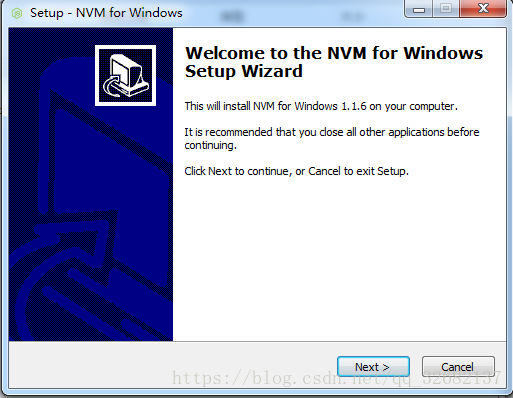

# Windows下安装及使用NVM

- node
- 专栏收录该内容
- 8 篇文章0 订阅
- 订阅专栏

所谓nvm就是一个可以让你在同一台机器上安装和切换不同版本node的工具。这里是一篇安装及使用教程。

## 第一步：下载nvm ##

可以到这里下载链接：https://pan.baidu.com/s/1wW4fH8XnXRiachXHb1Pckw 密码：pn90
或者到github上下载最新版本https://github.com/coreybutler/nvm-windows/releases

- nvm-noinstall.zip： 这个是绿色免安装版本，但是使用之前需要配置
- nvm-setup.zip：这是一个安装包，下载之后点击安装，无需配置就可以使用，方便。
- Source code(zip)：zip压缩的源码
- Sourc code(tar.gz)：tar.gz的源码，一般用于*nix系统

## 第二部：安装 ##

之后，按照提示完成安装即可，安装完成后可以检测一下是否安装成功
在命令行输入nvm，如果出现nvm版本号和一系列帮助指令，则说明nvm安装成功；否则，可能会提示nvm: command not found

## 第三步：修改settings.txt ##

在你安装的目录下找到settings.txt文件，打开后加上

    node_mirror: https://npm.taobao.org/mirrors/node/
    npm_mirror: https://npm.taobao.org/mirrors/npm/

这一步主要是将npm镜像改为淘宝的镜像，可以提高下载速度。

## 第四步：使用 ##

- nvm arch [32|64]： 显示node是运行在32位还是64位模式。指定32或64来覆盖默认体系结构。
- -nvm install <version> [arch]：该可以是node.js版本或最新稳定版本latest。（可选[arch]）指定安装32位或64位版本（默认为系统arch）。设置[arch]为all以安装32和64位版本。在命令后面添加–insecure，可以绕过远端下载服务器的SSL验证。
- nvm list [available]：列出已经安装的node.js版本。可选的available，显示可下载版本的部分列表。这个命令可以简写为nvm ls [available]。
- nvm on： 启用node.js版本管理。
- nvm off： 禁用node.js版本管理(不卸载任何东西)
- nvm proxy [url]： 设置用于下载的代理。留[url]空白，以查看当前的代理。设置[url]为none删除代理。
- nvm node_mirror [url]：设置node镜像，默认为https://nodejs.org/dist/.。可以设置为淘宝的镜像https://npm.taobao.org/mirrors/node/
- nvm npm_mirror [url]：设置npm镜像，默认为https://github.com/npm/npm/archive/。可以设置为淘宝的镜像https://npm.taobao.org/mirrors/npm/
- nvm uninstall <version>： 卸载指定版本的nodejs。
- nvm use [version] [arch]： 切换到使用指定的nodejs版本。可以指定32/64位[arch]。
- -nvm use <arch>：将继续使用所选版本，但根据提供的值切换到32/64位模式
- nvm root [path]： 设置 nvm 存储node.js不同版本的目录 ,如果未设置，将使用当前目录。
- -nvm version： 显示当前运行的nvm版本，可以简写为nvm v

首先，使用nvm list查看目前已经安装的版本

nvm list available 显示可下载版本的部分列表

nvm install 版本号 安装指定的版本的nodejs

nvm use 版本号 使用指定版本的nodejs

————————————————
版权声明：本文为CSDN博主「安歌的博客」的原创文章，遵循CC 4.0 BY-SA版权协议，转载请附上原文出处链接及本声明。
原文链接：https://blog.csdn.net/qq_32682137/article/details/82684898