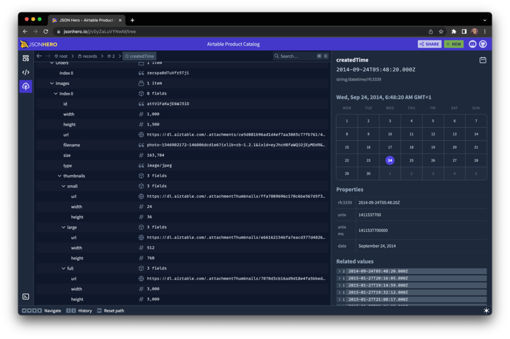

# 发现一款 JSON 可视化工具神器，太爱了！

简介

**JSON Hero** 是一个简单实用的 JSON 工具，通过简介美观的 UI 及增强的额外功能，使得阅读和理解 JSON 文档变得更容易、直观。

支持多种视图以便查看 JSON：列视图、树视图、JSON 视图等 列视图是受 macOS Finder 启发创建的一种浏览 JSON 文档的新方法。


> 项目地址：https://github.com/jsonhero-io/jsonhero-web

2

安装

要在本地运行 JSON Hero，首先 clone 源代码，并安装相关依赖项：

```
git clone https://github.com/jsonhero-io/jsonhero-web.gitcd jsonhero-webnpm install
```

然后运行以下命令启动，打开 http://localhost:8787 即可使用：

```
npm start
```

3

使用

前往 https://jsonhero.io/ 并将 JSON 文件拖拽到网站上，或在提供的表单中粘贴 JSON 或 JSON url

**内容预览**

JSON Hero 会自动推断字符串的内容，并对选择的值提供有用的预览和属性。

**日期和时间**



**图片网址**


**网站网址**


**JSON URL**


**树状视图**

这个也是用的最多的，树状图结构可以很清晰的展示，看一组图：


同时支持对JSON数据中的数据进行搜索：


重点来了！

当你完成数据编辑或者审核后，需要分享给前端，不必复制全部数据，只需要生成指定链接即可，这个很方便。


整体来讲，JSON Hero 支持多种试图查看JSON数据，同时支持VS Code 等扩展，相信对经常处理JSON的小伙伴来说，是一款很给力的工具。