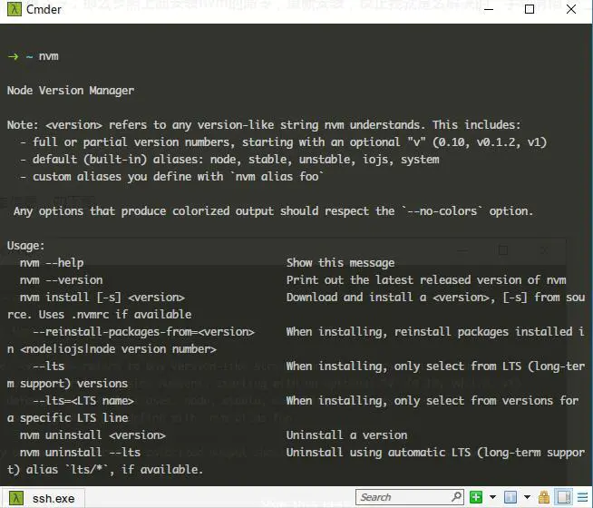

# 安装node版本管理工具之NVM #

- nvm是个啥？nvm是一个可以让你在同一台机器上安装和切换不同版本node的工具
- linux系统的github地址：[点我](https://link.jianshu.com/?t=https://github.com/creationix/nvm)
- 如果你是windows系统，直接下载安装就好了，附
- windows-nvm的github地址 [点我](https://link.jianshu.com/?t=https://github.com/coreybutler/nvm-windows)
- windows-nvm的下载地址 [点我去下载](https://link.jianshu.com/?t=https://github.com/coreybutler/nvm-windows/releases)

## 1. 开始安装(Linux系统下) ##

可以通过curl或者wget进行安装，命令如下

curl方式

	curl -o- https://raw.githubusercontent.com/creationix/nvm/v0.33.1/install.sh | bash

wget方式

	wget -qO- https://raw.githubusercontent.com/creationix/nvm/v0.33.1/install.sh | bash

如果你系统没有安装git的话，请先安装git,安装命令请参考下面

ubuntu系统

	sudo apt-get install git

centos

	sudo yum install git

## 2. 可能遇到的问题 ##

安装完后，如果是用xshell连远程主机的话，先重连一次，不然会发现提示找不到nvm命令

可能出现依旧提示找不到nvm命令，那么请使用source命令，如下

	source ~/.bashrc

如果是zsh的话，请用

	source ~/.zshrc

如果还是提示找不到nvm命令，那么参照上面安装nvm的命令，重新安装，反正我就是么解决的，手动滑稽 (￣_,￣ )

## 3. 开始开车 ##

常用命令一览

终端输入nvm，会看到帮助信息

	nvm

我们会看到提示一堆信息，如下图

nvm命令

**3.1 nvm ls-remote**

列出全部可以安装的版本号

	nvm ls-remote

运行命令后，稍等一会，就会列出全部可以安装的版本号，如图

可以看出全部可用版本号，和当前安装了v7.8.0版本

**3.2 nvm install 版本号**

安装指定版本

	nvm install v7.9.0  #命令后加版本号就可以进行安装，字母v可以不写，如下图

安装后默认使用该版

**3.3 nvm use 版本号**

切换指定版本，切换效果是全局的

	nvm use v7.8.0

切换到7.8.0

**3.4 nvm current**

查看当前使用的版本

    nvm current

查看当前使用的版本

**3.5 nvm ls**

查看该系统已经安装的版本，这个命令也能看到当前使用的是哪个版本

查看已经安装的版本

## 4. 胡说八道 ##

这里只是列出一了安装方法和一些常用命令，更深入的了解还是要多看命令提示和去github看原版文档，如果这篇文章能帮助到你，我很高兴，┑(￣Д ￣)┍，谢谢观看。

作者：凯文先生Kevin

链接：https://www.jianshu.com/p/8671e439a811

来源：简书

著作权归作者所有。商业转载请联系作者获得授权，非商业转载请注明出处。